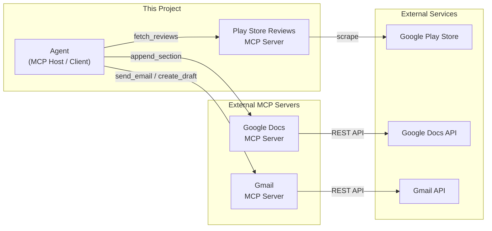
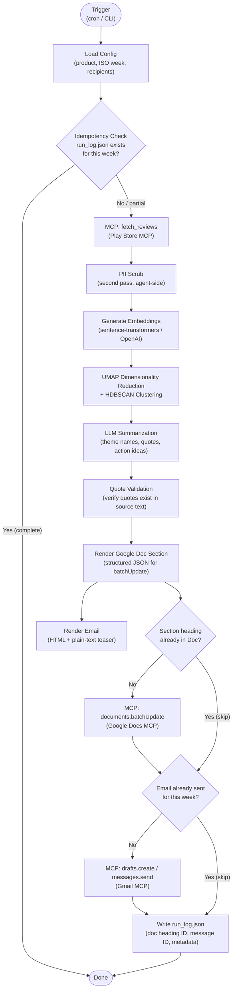
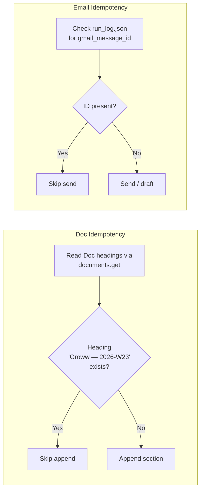
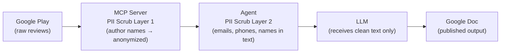

# Weekly Product Review Pulse — Architecture

> Derived from [problemStatement.md](file:///c:/Users/Lavanya%20gupta/OneDrive/Documents/Ghratika/Playstore/docs/problemStatement.md)
>
> **Scope:** Groww · Google Play Store reviews only · All delivery via MCP

---

## 1. System Overview

The system is an **MCP-native agent pipeline** that:

1. **Fetches** Groww reviews from Google Play via a custom **Play Store Reviews MCP server** (built in this repo).
2. **Analyzes** reviews through embedding-based clustering and LLM summarization.
3. **Delivers** a weekly insight report via **Google Docs MCP** and **Gmail MCP** servers.

The agent acts as an **MCP host/client** — it never calls Google APIs or scraping endpoints directly. Every external interaction flows through an MCP server's tool interface.



---

## 2. MCP Server Topology

Three MCP servers participate in the pipeline. One is **built in-house** (this repo); two are **external / third-party**.

| MCP Server                | Ownership     | Transport       | Purpose                                       |
|---------------------------|---------------|-----------------|-----------------------------------------------|
| **Play Store Reviews**    | This project  | stdio (local)   | Scrape & return Groww reviews from Google Play |
| **Google Docs**           | External      | SSE (remote)    | Append weekly report sections to a shared Doc  |
| **Gmail**                 | External      | SSE (remote)    | Send / draft stakeholder notification emails   |

> [!IMPORTANT]
> Google OAuth credentials live in the **external MCP servers' configuration**, never in this project's codebase.

### 2.1 Play Store Reviews MCP Server — Tool Interface

This server is the only custom MCP server we build. It exposes the following tools:

| Tool Name           | Parameters                                                                                             | Returns                                       |
|---------------------|--------------------------------------------------------------------------------------------------------|-----------------------------------------------|
| `fetch_reviews`     | `app_id` (str, e.g. `"com.groww.v1"`), `weeks` (int, default 12), `lang` (str, default `"en"`)        | `Review[]` — list of review objects            |
| `get_app_metadata`  | `app_id` (str)                                                                                         | App name, category, current rating, version   |

**`Review` object schema:**

```json
{
  "review_id": "gp_abc123",
  "author": "Redacted User",
  "rating": 3,
  "text": "The app crashes during market hours...",
  "date": "2026-05-28",
  "app_version": "4.8.1",
  "thumbs_up": 12,
  "language": "en"
}
```

> [!NOTE]
> The `author` field is **PII-scrubbed** at the MCP server level before returning to the agent. Usernames are replaced with anonymized placeholders (e.g. `"User_a3f2"`).

### 2.2 Google Docs MCP Server — Expected Tools

| Tool Name              | Parameters                                                        | Purpose                                   |
|------------------------|-------------------------------------------------------------------|-------------------------------------------|
| `documents.get`        | `documentId`                                                      | Read current doc structure (heading scan)  |
| `documents.batchUpdate`| `documentId`, `requests[]` (insert text, heading style, etc.)     | Append the weekly section to the doc       |

### 2.3 Gmail MCP Server — Expected Tools

| Tool Name            | Parameters                                                                 | Purpose                                  |
|----------------------|----------------------------------------------------------------------------|------------------------------------------|
| `drafts.create`      | `to`, `subject`, `htmlBody`, `textBody`                                    | Create a draft email (staging mode)       |
| `messages.send`      | `to`, `subject`, `htmlBody`, `textBody`                                    | Send the email (production mode)          |

---

## 3. Agent Pipeline — Detailed Flow



### 3.1 Step-by-Step Narrative

| Step | Component                   | Action                                                                                                        |
|------|-----------------------------|---------------------------------------------------------------------------------------------------------------|
| 1    | **CLI / Scheduler**         | Trigger with `--product groww --week 2026-W23` (or auto-detect current ISO week).                             |
| 2    | **Config Loader**           | Read `config.yaml` for app ID, review window, LLM provider, Doc ID, recipients.                               |
| 3    | **Idempotency Guard**       | Check `runs/<product>/<iso_week>/run_log.json`. If fully complete, exit early.                                 |
| 4    | **Review Ingestion**        | Call `fetch_reviews` on the Play Store Reviews MCP server. Receive `Review[]`.                                 |
| 5    | **PII Scrub (agent-side)**  | Second-pass scrub: strip emails, phone numbers, names from review text using regex + NER.                      |
| 6    | **Embedding**               | Embed each review's text using a sentence-transformer model (or OpenAI embeddings API).                        |
| 7    | **Clustering**              | UMAP projection → HDBSCAN density clustering → ranked clusters by size / avg. rating.                         |
| 8    | **LLM Summarization**       | Per cluster: generate theme name, select representative verbatim quotes, propose action ideas.                 |
| 9    | **Quote Validation**        | Verify every quoted string appears verbatim in the original review text. Discard fabricated quotes.            |
| 10   | **Doc Rendering**           | Build the Google Docs `batchUpdate` request payload (heading, body paragraphs, bullet lists).                  |
| 11   | **Email Rendering**         | Build HTML + plain-text email: subject line, top-3 theme bullets, "Read full report →" deep link.              |
| 12   | **Doc Delivery**            | Check if the section heading anchor already exists in the Doc. If not, call `documents.batchUpdate` via MCP.   |
| 13   | **Email Delivery**          | Check run log for email message ID. If not present, call `drafts.create` or `messages.send` via MCP.           |
| 14   | **Run Log**                 | Write `run_log.json` with all delivery identifiers, timestamps, review count, cluster count.                   |

---

## 4. Data Models

### 4.1 Review (ingested)

```typescript
interface Review {
  review_id:   string;    // "gp_<hash>"
  author:      string;    // PII-scrubbed at MCP level
  rating:      number;    // 1–5
  text:        string;    // raw review body
  date:        string;    // ISO 8601 date
  app_version: string;    // e.g. "4.8.1"
  thumbs_up:   number;    // helpfulness votes
  language:    string;    // BCP 47
}
```

### 4.2 Cluster (analysis output)

```typescript
interface Cluster {
  cluster_id:    number;
  theme_name:    string;       // LLM-generated, e.g. "App performance & bugs"
  summary:       string;       // 1–2 sentence cluster summary
  review_count:  number;
  avg_rating:    number;
  quotes:        ValidatedQuote[];
  action_ideas:  string[];
}

interface ValidatedQuote {
  text:       string;    // verbatim substring from a real review
  review_id:  string;    // traceability back to source
  rating:     number;
}
```

### 4.3 Run Log (audit record)

```typescript
interface RunLog {
  product:          string;    // "groww"
  iso_week:         string;    // "2026-W23"
  run_timestamp:    string;    // ISO 8601 datetime
  review_window:    { start: string; end: string };
  reviews_fetched:  number;
  clusters_found:   number;
  delivery: {
    doc_id:           string;
    doc_heading_id:   string;   // stable anchor for idempotency
    gmail_message_id: string | null;
    gmail_mode:       "draft" | "sent";
  };
  llm: {
    provider:     string;
    model:        string;
    tokens_used:  number;
    cost_usd:     number;
  };
  status:  "success" | "partial" | "failed";
  errors:  string[];
}
```

---

## 5. Idempotency Strategy

Re-running the same `(product, iso_week)` pair must be safe. The system guarantees this at two levels:



| Layer             | Mechanism                                                                                            |
|-------------------|------------------------------------------------------------------------------------------------------|
| **Run-level**     | `run_log.json` per `(product, iso_week)`. If `status: "success"`, the entire run is skipped.          |
| **Doc-level**     | Before appending, scan the Doc's headings for the week-specific anchor (e.g. `Groww — 2026-W23`). If found, skip. |
| **Email-level**   | The run log stores `gmail_message_id`. If populated, email send is skipped.                           |
| **Partial resume**| If `status: "partial"`, the agent resumes from the last incomplete step (e.g. doc appended but email failed). |

---

## 6. Directory Structure

```
Playstore/
├── docs/
│   ├── problemStatement.md          # Scoped problem definition
│   ├── problemStatement.txt         # Original plain-text version
│   └── architecture.md              # This file
│
├── src/
│   ├── agent/                       # Agent pipeline (MCP host/client)
│   │   ├── __init__.py
│   │   ├── main.py                  # CLI entrypoint & orchestrator
│   │   ├── config.py                # Config loader (config.yaml)
│   │   ├── ingestion.py             # Calls Play Store Reviews MCP
│   │   ├── pii_scrubber.py          # Agent-side PII scrubbing
│   │   ├── clustering.py            # UMAP + HDBSCAN pipeline
│   │   ├── summarizer.py            # LLM theme/quote/action generation
│   │   ├── quote_validator.py       # Verifies quotes against source text
│   │   ├── doc_renderer.py          # Builds Google Docs batchUpdate payload
│   │   ├── email_renderer.py        # Builds HTML/text email content
│   │   ├── delivery.py              # Calls Google Docs & Gmail MCP tools
│   │   └── idempotency.py           # Run log read/write, dedup checks
│   │
│   └── mcp_servers/
│       └── playstore_reviews/       # Play Store Reviews MCP Server
│           ├── __init__.py
│           ├── server.py            # MCP server setup (stdio transport)
│           ├── tools.py             # fetch_reviews, get_app_metadata
│           ├── scraper.py           # Google Play scraping logic
│           └── pii.py               # Server-side PII scrub (author names)
│
├── config/
│   ├── config.yaml                  # Product config, MCP endpoints, LLM settings
│   └── config.example.yaml          # Template with placeholder values
│
├── runs/                            # Run logs (git-ignored)
│   └── groww/
│       └── 2026-W23/
│           └── run_log.json
│
├── tests/
│   ├── test_ingestion.py
│   ├── test_clustering.py
│   ├── test_summarizer.py
│   ├── test_quote_validator.py
│   ├── test_doc_renderer.py
│   ├── test_email_renderer.py
│   └── test_idempotency.py
│
├── requirements.txt
├── pyproject.toml
├── .env.example                     # LLM API keys (never committed)
├── .gitignore
└── README.md
```

---

## 7. Configuration

All runtime knobs live in `config/config.yaml`:

```yaml
# --- Product ---
product:
  name: "Groww"
  play_store_app_id: "com.groww.v1"
  review_window_weeks: 12            # Rolling window (8–12 configurable)

# --- MCP Servers ---
mcp_servers:
  playstore_reviews:
    transport: "stdio"
    command: "python"
    args: ["-m", "src.mcp_servers.playstore_reviews.server"]

  google_docs:
    transport: "sse"
    url: "https://mcp-server-ghratika-production.up.railway.app/sse"

  gmail:
    transport: "sse"
    url: "https://mcp-server-ghratika-production.up.railway.app/sse"

# --- Delivery ---
delivery:
  google_doc_id: "1aBcDeFgHiJkLmNoPqRsTuVwXyZ"   # Shared pulse doc
  recipients:
    - "product-team@groww.in"
    - "support-leads@groww.in"
  email_mode: "draft"                 # "draft" for staging, "sent" for production
  email_subject_template: "Groww Review Pulse — {iso_week}"

# --- LLM ---
llm:
  provider: "openai"                  # or "anthropic", "google"
  model: "gpt-4o"
  max_tokens_per_run: 30000
  cost_limit_usd: 2.00

# --- Clustering ---
clustering:
  embedding_model: "all-MiniLM-L6-v2"   # sentence-transformers
  umap_n_neighbors: 15
  umap_n_components: 5
  hdbscan_min_cluster_size: 5
  max_themes: 8
```

---

## 8. Security & Safety

### 8.1 PII Handling — Two-Layer Defense



| Layer                | What It Scrubs                                       | How                                          |
|----------------------|------------------------------------------------------|----------------------------------------------|
| **MCP Server (L1)**  | Author/reviewer display names                        | Replace with `User_<hash>` before returning  |
| **Agent (L2)**       | Emails, phone numbers, proper names in review text   | Regex patterns + lightweight NER model       |

### 8.2 LLM Safety

| Concern                       | Mitigation                                                                       |
|-------------------------------|----------------------------------------------------------------------------------|
| Prompt injection via reviews  | Reviews are passed as **data** in a structured field, never interpolated into system prompts |
| Cost runaway                  | Hard `max_tokens_per_run` and `cost_limit_usd` in config; agent aborts if exceeded |
| Fabricated quotes             | `quote_validator.py` checks every LLM-generated quote against source review text  |

### 8.3 Credential Isolation

- **Google OAuth tokens** live in external MCP server configs (env vars), never in this repo.
- **LLM API keys** live in `.env` (git-ignored), loaded via `python-dotenv`.
- **No secrets in config.yaml** — sensitive paths are referenced via `${ENV_VAR}` syntax.

---

## 9. Delivery Format

### 9.1 Google Doc Section

Each weekly run appends a section structured like:

```
## Groww — 2026-W23
**Period:** 2026-03-30 → 2026-06-01 (12-week window)
**Reviews analyzed:** 847

### Top Themes

1. **App performance & bugs** (312 reviews, avg ★2.1)
   Lag, crashes during trading hours; login/session timeouts.
   > "The app freezes exactly when the market opens, very frustrating."

2. **Customer support friction** (198 reviews, avg ★1.8)
   ...

### Action Ideas
- Stabilize peak-time performance — ...
- Improve support SLA visibility — ...

### What This Solves
Roadmap alignment for product, issue clustering for support, ...
```

The heading `Groww — 2026-W23` serves as the **stable anchor** for idempotency checks and deep-link generation.

### 9.2 Stakeholder Email

```
Subject: Groww Review Pulse — 2026-W23

Body:
  This week's top themes from 847 Groww reviews:
  • App performance & bugs (312 mentions)
  • Customer support friction (198 mentions)
  • UX & feature gaps (134 mentions)

  📄 Read the full report → [link to Doc heading]

  ---
  This is an automated report from the Weekly Review Pulse system.
```

- **Staging:** `drafts.create` (saved as draft, not sent)
- **Production:** `messages.send` (delivered to recipients)

---

## 10. Error Handling & Observability

| Scenario                       | Behavior                                                          |
|--------------------------------|-------------------------------------------------------------------|
| Play Store MCP returns 0 reviews | Abort run, log error, do **not** append empty section to Doc     |
| Clustering produces 0 clusters | Abort run, log warning (reviews may be too few / too homogeneous) |
| LLM call fails / times out    | Retry up to 3× with exponential backoff; then abort and log      |
| Google Docs MCP fails          | Log error, set `status: "partial"` in run log; email step skipped |
| Gmail MCP fails                | Log error, set `status: "partial"`; doc section is already saved  |
| Token / cost limit exceeded    | Abort LLM calls, produce partial report with available clusters   |

### Run Log as Audit Trail

Every run writes `runs/groww/<iso_week>/run_log.json` capturing:
- Review count, cluster count, LLM token usage
- Doc heading ID, Gmail message ID
- Full error log if any step failed
- `status` field: `"success"` | `"partial"` | `"failed"`

---

## 11. Technology Stack

| Component              | Technology                                                  |
|------------------------|-------------------------------------------------------------|
| Language               | Python 3.11+                                                |
| MCP SDK                | `mcp` Python SDK (for both server and client)               |
| Play Store scraping    | `google-play-scraper` (Python library)                      |
| Embeddings             | `sentence-transformers` (`all-MiniLM-L6-v2`) or OpenAI API  |
| Dimensionality reduction | `umap-learn`                                              |
| Clustering             | `hdbscan`                                                   |
| LLM                    | OpenAI / Anthropic / Google (configurable via `litellm`)    |
| PII scrubbing          | Regex + `presidio-analyzer` (lightweight NER)               |
| Config                 | `pyyaml` + `python-dotenv`                                  |
| CLI                    | `click` or `argparse`                                       |
| Testing                | `pytest` + `pytest-asyncio`                                 |

---

## 12. Future Extensibility

While these are non-goals for the initial build, the architecture is designed so they can be added cleanly:

| Future Capability           | Extension Point                                                    |
|-----------------------------|--------------------------------------------------------------------|
| Apple App Store reviews     | Add a new MCP server (or extend Play Store MCP with a second tool) |
| Multi-product support       | Parameterize `config.yaml` with a product list; loop in orchestrator |
| Additional social sources   | New MCP servers per source (Twitter, Reddit, etc.)                 |
| Dashboard / BI integration  | Export `RunLog` + `Cluster[]` as structured JSON for downstream BI |
| Slack / Teams delivery      | Add Slack/Teams MCP server alongside Gmail MCP                     |
