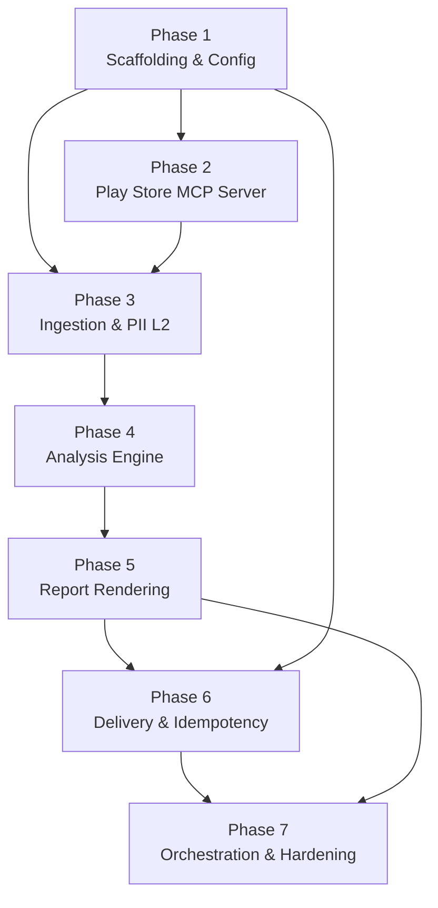

# Weekly Product Review Pulse — Phase-Wise Implementation Plan

> Derived from [architecture.md](file:///c:/Users/Lavanya%20gupta/OneDrive/Documents/Ghratika/Playstore/docs/architecture.md) and [problemStatement.md](file:///c:/Users/Lavanya%20gupta/OneDrive/Documents/Ghratika/Playstore/docs/problemStatement.md)
>
> **Product:** Groww · **Source:** Google Play Store · **Delivery:** MCP-only (Google Docs + Gmail)

---

## Phase 1 — Project Scaffolding & Configuration

**Objective:** Establish the project skeleton, dependency management, configuration system, and CLI entrypoint so all subsequent phases have a stable foundation.

### Files Involved

#### [NEW] [pyproject.toml](file:///c:/Users/Lavanya%20gupta/OneDrive/Documents/Ghratika/Playstore/pyproject.toml)
- Project metadata (name, version, description, Python `>=3.11`)
- All dependencies as defined in [architecture §11](file:///c:/Users/Lavanya%20gupta/OneDrive/Documents/Ghratika/Playstore/docs/architecture.md#L491-L506):
  - `mcp`, `google-play-scraper`, `sentence-transformers`, `umap-learn`, `hdbscan`
  - `litellm` (multi-provider LLM), `presidio-analyzer` (PII NER)
  - `pyyaml`, `python-dotenv`, `click`, `pytest`, `pytest-asyncio`
- CLI entrypoint: `[project.scripts] pulse = "src.agent.main:cli"`

#### [NEW] [requirements.txt](file:///c:/Users/Lavanya%20gupta/OneDrive/Documents/Ghratika/Playstore/requirements.txt)
- Flat pip-installable dependency list (mirror of pyproject.toml deps)

#### [NEW] [.gitignore](file:///c:/Users/Lavanya%20gupta/OneDrive/Documents/Ghratika/Playstore/.gitignore)
- Ignore: `.env`, `runs/`, `__pycache__/`, `*.egg-info/`, `.venv/`

#### [MODIFY] [.env.example](file:///c:/Users/Lavanya%20gupta/OneDrive/Documents/Ghratika/Playstore/.env.example)
- Ensure placeholders for: `OPENAI_API_KEY`, `ANTHROPIC_API_KEY`, `GOOGLE_CREDENTIALS_PATH`

#### [NEW] [config/config.yaml](file:///c:/Users/Lavanya%20gupta/OneDrive/Documents/Ghratika/Playstore/config/config.yaml)
- Full configuration per [architecture §7](file:///c:/Users/Lavanya%20gupta/OneDrive/Documents/Ghratika/Playstore/docs/architecture.md#L323-L378):
  - Product: `name`, `play_store_app_id`, `review_window_weeks`
  - MCP servers: `playstore_reviews` (stdio), `google_docs` (sse), `gmail` (sse)
  - Delivery: `google_doc_id`, `recipients[]`, `email_mode`, `email_subject_template`
  - LLM: `provider` (`groq`), `model` (`llama-3.3-70b-versatile`), `max_tokens_per_run`, `requests_per_minute`, `requests_per_day`, `tokens_per_minute`, `tokens_per_day`
  - Clustering: `embedding_model`, `umap_*`, `hdbscan_*`, `max_themes`

#### [NEW] [config/config.example.yaml](file:///c:/Users/Lavanya%20gupta/OneDrive/Documents/Ghratika/Playstore/config/config.example.yaml)
- Template with placeholder values and inline comments

#### [NEW] [src/agent/__init__.py](file:///c:/Users/Lavanya%20gupta/OneDrive/Documents/Ghratika/Playstore/src/agent/__init__.py)
- Package init

#### [NEW] [src/agent/config.py](file:///c:/Users/Lavanya%20gupta/OneDrive/Documents/Ghratika/Playstore/src/agent/config.py)
- `load_config(path: str) -> dict` — load & validate `config.yaml` using PyYAML
- Merge env-var substitutions (`${ENV_VAR}` syntax)
- Validate required fields; raise clear errors on missing keys

#### [NEW] [src/agent/main.py](file:///c:/Users/Lavanya%20gupta/OneDrive/Documents/Ghratika/Playstore/src/agent/main.py)
- CLI entrypoint using `click`:
  - `--product` (default: `groww`)
  - `--week` (ISO week, e.g. `2026-W23`; auto-detect if omitted)
  - `--config` (path to config.yaml)
  - `--dry-run` flag (skip delivery steps)
- Skeleton orchestrator that loads config and prints run parameters (actual pipeline steps added in later phases)

#### [NEW] [src/mcp_servers/playstore_reviews/__init__.py](file:///c:/Users/Lavanya%20gupta/OneDrive/Documents/Ghratika/Playstore/src/mcp_servers/playstore_reviews/__init__.py)
- Package init

#### [NEW] [README.md](file:///c:/Users/Lavanya%20gupta/OneDrive/Documents/Ghratika/Playstore/README.md)
- Project overview, setup instructions, CLI usage, architecture link

### Tasks
1. Create directory structure: `src/agent/`, `src/mcp_servers/playstore_reviews/`, `config/`, `runs/`, `tests/`
2. Write `pyproject.toml` and `requirements.txt`
3. Create `.gitignore`
4. Update `.env.example` with all required env vars
5. Write `config/config.yaml` and `config/config.example.yaml`
6. Implement `src/agent/config.py` — YAML loader with env-var interpolation
7. Implement `src/agent/main.py` — Click CLI skeleton
8. Create all `__init__.py` files
9. Write `README.md`

### Acceptance Criteria
- [ ] `pip install -e .` succeeds
- [ ] `python -m src.agent.main --help` prints usage
- [ ] `python -m src.agent.main --product groww --week 2026-W23` loads config and prints parameters
- [ ] Config loader raises `ValueError` on missing required keys

---

## Phase 2 — Play Store Reviews MCP Server

**Objective:** Build the custom MCP server that scrapes Groww reviews from Google Play and exposes them via MCP tools (`fetch_reviews`, `get_app_metadata`), including server-side PII scrubbing (Layer 1).

### Files Involved

#### [NEW] [src/mcp_servers/playstore_reviews/server.py](file:///c:/Users/Lavanya%20gupta/OneDrive/Documents/Ghratika/Playstore/src/mcp_servers/playstore_reviews/server.py)
- MCP server setup using `mcp` Python SDK
- stdio transport configuration
- Register tools: `fetch_reviews`, `get_app_metadata`

#### [NEW] [src/mcp_servers/playstore_reviews/tools.py](file:///c:/Users/Lavanya%20gupta/OneDrive/Documents/Ghratika/Playstore/src/mcp_servers/playstore_reviews/tools.py)
- `fetch_reviews(app_id: str, weeks: int = 12, lang: str = "en") -> list[Review]`
  - Calls `scraper.py` to get raw reviews
  - Passes through `pii.py` for author-name anonymization (Layer 1)
  - Returns `Review[]` per schema in [architecture §2.1](file:///c:/Users/Lavanya%20gupta/OneDrive/Documents/Ghratika/Playstore/docs/architecture.md#L62-L88)
- `get_app_metadata(app_id: str) -> dict`
  - Returns: `app_name`, `category`, `current_rating`, `version`

#### [NEW] [src/mcp_servers/playstore_reviews/scraper.py](file:///c:/Users/Lavanya%20gupta/OneDrive/Documents/Ghratika/Playstore/src/mcp_servers/playstore_reviews/scraper.py)
- Uses `google-play-scraper` library
- `scrape_reviews(app_id, weeks, lang) -> list[dict]` — fetch reviews within the date window
- `scrape_app_info(app_id) -> dict` — fetch app metadata
- Handle pagination, rate limiting, and empty results gracefully

#### [NEW] [src/mcp_servers/playstore_reviews/pii.py](file:///c:/Users/Lavanya%20gupta/OneDrive/Documents/Ghratika/Playstore/src/mcp_servers/playstore_reviews/pii.py)
- **Layer 1 PII scrub** per [architecture §8.1](file:///c:/Users/Lavanya%20gupta/OneDrive/Documents/Ghratika/Playstore/docs/architecture.md#L382-L401)
- `anonymize_author(name: str) -> str` — replace author display names with `User_<hash>`
- Hash must be deterministic (same name → same pseudonym) for consistency

#### [NEW] [tests/test_scraper.py](file:///c:/Users/Lavanya%20gupta/OneDrive/Documents/Ghratika/Playstore/tests/test_scraper.py)
- Unit tests with mocked `google-play-scraper` responses
- Test: review date filtering, pagination handling, empty results

#### [NEW] [tests/test_pii_server.py](file:///c:/Users/Lavanya%20gupta/OneDrive/Documents/Ghratika/Playstore/tests/test_pii_server.py)
- Test: author anonymization produces deterministic hashes
- Test: original names never appear in output

### Tasks
1. Implement `scraper.py` — Google Play review fetching with date-window filtering
2. Implement `pii.py` — deterministic author anonymization (SHA-256 based short hash)
3. Implement `tools.py` — wire scraper + PII into `fetch_reviews` and `get_app_metadata` tool functions
4. Implement `server.py` — MCP server registration with stdio transport
5. Write unit tests for scraper (mocked) and PII module
6. Manual test: `python -m src.mcp_servers.playstore_reviews.server` starts without errors

### Data Model: `Review` (output of this phase)

```json
{
  "review_id": "gp_abc123",
  "author": "User_a3f2",
  "rating": 3,
  "text": "The app crashes during market hours...",
  "date": "2026-05-28",
  "app_version": "4.8.1",
  "thumbs_up": 12,
  "language": "en"
}
```

### Acceptance Criteria
- [ ] MCP server starts on stdio and responds to `fetch_reviews` tool calls
- [ ] Reviews are returned with anonymized author names (`User_<hash>`)
- [ ] `get_app_metadata` returns correct app info
- [ ] Date-window filtering correctly limits reviews to the configured weeks
- [ ] All unit tests pass

---

## Phase 3 — Review Ingestion & Agent-Side PII Scrubbing

**Objective:** Build the agent's MCP client that connects to the Play Store Reviews MCP server, fetches reviews, and applies the second-pass PII scrubbing (Layer 2) on review text before any LLM processing.

### Files Involved

#### [NEW] [src/agent/ingestion.py](file:///c:/Users/Lavanya%20gupta/OneDrive/Documents/Ghratika/Playstore/src/agent/ingestion.py)
- `fetch_reviews_via_mcp(config: dict) -> list[Review]`
  - Connect to Play Store Reviews MCP server via stdio transport
  - Call `fetch_reviews` tool with `app_id`, `weeks`, `lang` from config
  - Parse and validate response into `Review` objects
  - Pass review texts through `pii_scrubber.py` (Layer 2)
  - Abort with logged error if 0 reviews returned (per [architecture §10](file:///c:/Users/Lavanya%20gupta/OneDrive/Documents/Ghratika/Playstore/docs/architecture.md#L470-L488))

#### [NEW] [src/agent/pii_scrubber.py](file:///c:/Users/Lavanya%20gupta/OneDrive/Documents/Ghratika/Playstore/src/agent/pii_scrubber.py)
- **Layer 2 PII scrub** per [architecture §8.1](file:///c:/Users/Lavanya%20gupta/OneDrive/Documents/Ghratika/Playstore/docs/architecture.md#L396-L401)
- `scrub_text(text: str) -> str`
  - Regex patterns: emails (`\S+@\S+`), phone numbers (Indian/international formats)
  - Lightweight NER via `presidio-analyzer`: detect and redact `PERSON`, `PHONE_NUMBER`, `EMAIL_ADDRESS` entities
  - Replace matches with `[REDACTED]`
- `scrub_reviews(reviews: list[Review]) -> list[Review]`
  - Apply `scrub_text` to each review's `text` field

#### [NEW] [tests/test_ingestion.py](file:///c:/Users/Lavanya%20gupta/OneDrive/Documents/Ghratika/Playstore/tests/test_ingestion.py)
- Test: MCP client connects and retrieves reviews (mocked MCP server)
- Test: 0-review response triggers abort with error log

#### [NEW] [tests/test_pii_scrubber.py](file:///c:/Users/Lavanya%20gupta/OneDrive/Documents/Ghratika/Playstore/tests/test_pii_scrubber.py)
- Test: emails, phone numbers, and names are redacted from review text
- Test: non-PII text is preserved unchanged

### Tasks
1. Implement `pii_scrubber.py` — regex + Presidio-based text scrubbing
2. Implement `ingestion.py` — MCP client connection and review fetching
3. Wire ingestion into `main.py` orchestrator (called after config load)
4. Write unit tests for PII scrubber and ingestion
5. Integration test: agent connects to locally-running Play Store MCP server and retrieves scrubbed reviews

### Acceptance Criteria
- [ ] Agent connects to Play Store Reviews MCP server and receives `Review[]`
- [ ] Email addresses, phone numbers, and names in review text are replaced with `[REDACTED]`
- [ ] Non-PII text is preserved exactly
- [ ] 0-review response aborts the run with a clear error message
- [ ] All unit tests pass

---

## Phase 4 — Analysis Engine (Embedding, Clustering, LLM Summarization)

**Objective:** Build the core analysis pipeline: generate embeddings, cluster reviews by theme using UMAP + HDBSCAN, then use an LLM to name themes, extract validated quotes, and propose action ideas.

### Files Involved

#### [NEW] [src/agent/clustering.py](file:///c:/Users/Lavanya%20gupta/OneDrive/Documents/Ghratika/Playstore/src/agent/clustering.py)
- `embed_reviews(reviews: list[Review], model_name: str) -> np.ndarray`
  - Generate embeddings using `sentence-transformers` (default: `all-MiniLM-L6-v2`)
  - Support OpenAI embeddings API as alternative (configurable)
- `cluster_reviews(embeddings: np.ndarray, reviews: list[Review], config: dict) -> list[RawCluster]`
  - UMAP dimensionality reduction with config params (`n_neighbors`, `n_components`)
  - HDBSCAN density clustering with `min_cluster_size` from config
  - Rank clusters by size (descending), cap at `max_themes`
  - Return `RawCluster` objects: `{ cluster_id, review_indices, avg_rating, review_count }`
- Handle edge case: 0 clusters → abort run with warning (per [architecture §10](file:///c:/Users/Lavanya%20gupta/OneDrive/Documents/Ghratika/Playstore/docs/architecture.md#L475))

#### [NEW] [src/agent/summarizer.py](file:///c:/Users/Lavanya%20gupta/OneDrive/Documents/Ghratika/Playstore/src/agent/summarizer.py)
- `summarize_clusters(raw_clusters: list[RawCluster], reviews: list[Review], config: dict) -> list[Cluster]`
  - For each cluster, send the cluster's review texts to the LLM via `litellm`
  - **LLM provider: Groq** — model `llama-3.3-70b-versatile` via `litellm` (`groq/llama-3.3-70b-versatile`)
  - **Groq free-tier rate limits** (must be respected by the summarizer):
    - 30 requests/minute · 1,000 requests/day
    - 12,000 tokens/minute · 100,000 tokens/day
  - Rate-limit strategy: batch clusters with inter-call delays; track running token count and abort if `tokens_per_day` limit would be exceeded
  - LLM prompt structure (reviews as **data**, not interpolated into system prompt — per [architecture §8.2](file:///c:/Users/Lavanya%20gupta/OneDrive/Documents/Ghratika/Playstore/docs/architecture.md#L402-L409)):
    - System: "You are a product analyst summarizing app reviews..."
    - User: structured JSON of review texts
    - Response format: `{ theme_name, summary, quotes: [{text, review_id}], action_ideas: [str] }`
  - Track token usage; abort if `tokens_per_day` (100K) or `requests_per_day` (1K) limits would be exceeded
  - Retry LLM calls up to 3× with exponential backoff on failure (per [architecture §10](file:///c:/Users/Lavanya%20gupta/OneDrive/Documents/Ghratika/Playstore/docs/architecture.md#L476))

#### [NEW] [src/agent/quote_validator.py](file:///c:/Users/Lavanya%20gupta/OneDrive/Documents/Ghratika/Playstore/src/agent/quote_validator.py)
- `validate_quotes(clusters: list[Cluster], reviews: list[Review]) -> list[Cluster]`
  - For each quote in each cluster, verify the `text` appears as a **verbatim substring** in the referenced review's text
  - Discard quotes that don't match (LLM fabrications)
  - Log discarded quotes for observability
  - Return cleaned clusters with only validated quotes

### Data Model: `Cluster` (output of this phase)

```typescript
interface Cluster {
  cluster_id:    number;
  theme_name:    string;       // LLM-generated
  summary:       string;       // 1–2 sentence summary
  review_count:  number;
  avg_rating:    number;
  quotes:        ValidatedQuote[];
  action_ideas:  string[];
}

interface ValidatedQuote {
  text:       string;    // verbatim substring from a real review
  review_id:  string;    // traceability
  rating:     number;
}
```

#### [NEW] [tests/test_clustering.py](file:///c:/Users/Lavanya%20gupta/OneDrive/Documents/Ghratika/Playstore/tests/test_clustering.py)
- Test: embedding generation produces correct dimensions
- Test: clustering with synthetic data produces expected cluster count
- Test: 0-cluster edge case triggers abort

#### [NEW] [tests/test_summarizer.py](file:///c:/Users/Lavanya%20gupta/OneDrive/Documents/Ghratika/Playstore/tests/test_summarizer.py)
- Test: LLM response is parsed into `Cluster` objects correctly (mocked LLM)
- Test: token/cost limit enforcement
- Test: retry logic on LLM failure

#### [NEW] [tests/test_quote_validator.py](file:///c:/Users/Lavanya%20gupta/OneDrive/Documents/Ghratika/Playstore/tests/test_quote_validator.py)
- Test: verbatim quotes pass validation
- Test: fabricated quotes are discarded
- Test: case-sensitive matching

### Tasks
1. Implement `clustering.py` — embeddings (sentence-transformers) + UMAP + HDBSCAN pipeline
2. Implement `summarizer.py` — LLM-based theme naming, quote extraction, action ideas via `litellm`
3. Implement `quote_validator.py` — verbatim quote verification against source reviews
4. Wire analysis steps into `main.py` orchestrator (after ingestion)
5. Write unit tests with mocked embeddings, synthetic clusters, and mocked LLM responses
6. End-to-end manual test: ingest real reviews → cluster → summarize → validate quotes

### Acceptance Criteria
- [ ] Embeddings generated for all reviews (correct dimensionality)
- [ ] UMAP + HDBSCAN produces meaningful clusters from real review data
- [ ] Groq (`llama-3.3-70b-versatile`) generates theme names, summaries, quotes, and action ideas per cluster
- [ ] All quotes in the final output are verified as verbatim substrings of real reviews
- [ ] Summarizer respects Groq rate limits: 30 RPM, 1K RPD, 12K TPM, 100K TPD
- [ ] Run aborts with a clear message when daily token/request limits would be exceeded
- [ ] LLM failures trigger up to 3 retries with exponential backoff
- [ ] All unit tests pass

---

## Phase 5 — Report Rendering (Google Doc + Email)

**Objective:** Build renderers that convert analysis output (clusters) into structured payloads for Google Docs (batchUpdate JSON) and stakeholder emails (HTML + plain-text).

### Files Involved

#### [NEW] [src/agent/doc_renderer.py](file:///c:/Users/Lavanya%20gupta/OneDrive/Documents/Ghratika/Playstore/src/agent/doc_renderer.py)
- `render_doc_section(clusters: list[Cluster], metadata: dict) -> dict`
  - Build the Google Docs `batchUpdate` request payload per [architecture §9.1](file:///c:/Users/Lavanya%20gupta/OneDrive/Documents/Ghratika/Playstore/docs/architecture.md#L418-L446)
  - Section heading: `"Groww — {iso_week}"` (stable anchor for idempotency)
  - Period line, review count, themed subsections with quotes and action ideas
  - Structured as `requests[]` array: insert text, apply heading styles, bullet lists
  - Metadata includes: `iso_week`, `review_count`, `review_window` (start/end dates)

#### [NEW] [src/agent/email_renderer.py](file:///c:/Users/Lavanya%20gupta/OneDrive/Documents/Ghratika/Playstore/src/agent/email_renderer.py)
- `render_email(clusters: list[Cluster], metadata: dict, config: dict) -> EmailPayload`
  - Per [architecture §9.2](file:///c:/Users/Lavanya%20gupta/OneDrive/Documents/Ghratika/Playstore/docs/architecture.md#L448-L467):
    - Subject: from `email_subject_template` in config (e.g., `"Groww Review Pulse — 2026-W23"`)
    - HTML body: top-3 theme bullets with mention counts, "Read full report →" deep link to Doc heading
    - Plain-text body: fallback version of the same content
  - `EmailPayload` type: `{ subject, html_body, text_body, to: list[str] }`
  - Deep link construction: `https://docs.google.com/document/d/{doc_id}/edit#heading={heading_id}`

#### [NEW] [tests/test_doc_renderer.py](file:///c:/Users/Lavanya%20gupta/OneDrive/Documents/Ghratika/Playstore/tests/test_doc_renderer.py)
- Test: correct heading format (`"Groww — 2026-W23"`)
- Test: all clusters appear in the payload
- Test: quote formatting and action ideas section

#### [NEW] [tests/test_email_renderer.py](file:///c:/Users/Lavanya%20gupta/OneDrive/Documents/Ghratika/Playstore/tests/test_email_renderer.py)
- Test: subject line uses configured template
- Test: HTML contains top-3 themes and deep link
- Test: plain-text fallback is well-formed

### Tasks
1. Implement `doc_renderer.py` — build Google Docs batchUpdate payload
2. Implement `email_renderer.py` — build HTML + plain-text email with deep link
3. Wire renderers into `main.py` orchestrator (after analysis)
4. Write unit tests for both renderers
5. Manual review: inspect rendered Doc JSON and email HTML for correctness

### Acceptance Criteria
- [ ] Doc payload produces valid `batchUpdate` request structure
- [ ] Section heading matches `"Groww — {iso_week}"` format
- [ ] Email subject uses the configured template
- [ ] Email HTML includes top-3 themes and a clickable deep link to the Doc section
- [ ] Plain-text email is a readable fallback
- [ ] All unit tests pass

---

## Phase 6 — Delivery via MCP (Google Docs + Gmail) & Idempotency

**Objective:** Implement the delivery layer that appends report sections to Google Docs and sends/drafts emails via their respective MCP servers, with full idempotency guarantees and run logging.

### Files Involved

#### [NEW] [src/agent/delivery.py](file:///c:/Users/Lavanya%20gupta/OneDrive/Documents/Ghratika/Playstore/src/agent/delivery.py)
- `deliver_doc(doc_payload: dict, config: dict) -> str`
  - Connect to Google Docs MCP server (stdio or SSE transport, per config)
  - **Doc idempotency** per [architecture §5](file:///c:/Users/Lavanya%20gupta/OneDrive/Documents/Ghratika/Playstore/docs/architecture.md#L228-L261):
    1. Call `documents.get` to read current Doc headings
    2. Check if heading `"Groww — {iso_week}"` already exists
    3. If exists → skip and return existing heading ID
    4. If not → call `documents.batchUpdate` to append section
  - Return the heading ID for run log and deep link
- `deliver_email(email_payload: EmailPayload, config: dict, run_log: RunLog) -> str | None`
  - **Email idempotency**: check `run_log.delivery.gmail_message_id` — if present, skip
  - Connect to Gmail MCP server
  - Based on `email_mode` in config:
    - `"draft"` → call `drafts.create`
    - `"sent"` → call `messages.send`
  - Return `gmail_message_id` for run log

#### [NEW] [src/agent/idempotency.py](file:///c:/Users/Lavanya%20gupta/OneDrive/Documents/Ghratika/Playstore/src/agent/idempotency.py)
- `check_run_log(product: str, iso_week: str) -> RunLog | None`
  - Read `runs/{product}/{iso_week}/run_log.json`
  - If `status: "success"` → return log (caller skips entire run)
  - If `status: "partial"` → return log (caller resumes from last incomplete step)
  - If not found → return `None` (fresh run)
- `write_run_log(log: RunLog) -> None`
  - Write/update `runs/{product}/{iso_week}/run_log.json`
  - Create directories as needed

### Data Model: `RunLog` (audit record)

```json
{
  "product": "groww",
  "iso_week": "2026-W23",
  "run_timestamp": "2026-06-07T14:30:00Z",
  "review_window": { "start": "2026-03-30", "end": "2026-06-01" },
  "reviews_fetched": 847,
  "clusters_found": 5,
  "delivery": {
    "doc_id": "1aBcDeFg...",
    "doc_heading_id": "h.abc123",
    "gmail_message_id": "msg_xyz789",
    "gmail_mode": "draft"
  },
  "llm": {
    "provider": "groq",
    "model": "llama-3.3-70b-versatile",
    "tokens_used": 12500
  },
  "status": "success",
  "errors": []
}
```

#### [NEW] [tests/test_idempotency.py](file:///c:/Users/Lavanya%20gupta/OneDrive/Documents/Ghratika/Playstore/tests/test_idempotency.py)
- Test: fresh run returns `None`
- Test: `status: "success"` skips entire run
- Test: `status: "partial"` allows resume
- Test: run log is written correctly to filesystem

#### [NEW] [tests/test_delivery.py](file:///c:/Users/Lavanya%20gupta/OneDrive/Documents/Ghratika/Playstore/tests/test_delivery.py)
- Test: Doc heading check prevents duplicate sections (mocked MCP)
- Test: Email skip when `gmail_message_id` exists
- Test: Draft mode calls `drafts.create`, send mode calls `messages.send`

### Tasks
1. Implement `idempotency.py` — run log read/write and status checks
2. Implement `delivery.py` — Google Docs MCP client (with heading check) + Gmail MCP client (with email dedup)
3. Wire delivery and idempotency into `main.py` orchestrator
4. Write unit tests for idempotency and delivery (mocked MCP servers)
5. Integration test: full pipeline with `--dry-run` flag (verify all steps up to delivery)

### Acceptance Criteria
- [ ] Re-running `(groww, 2026-W23)` with `status: "success"` exits early
- [ ] Partial runs resume from the last incomplete step
- [ ] Doc section is not duplicated if the heading already exists
- [ ] Email is not sent/drafted if `gmail_message_id` is already recorded
- [ ] Run log captures all metadata: review count, cluster count, LLM usage, delivery IDs
- [ ] `--dry-run` flag skips Doc append and email send
- [ ] All unit tests pass

---

## Phase 7 — Orchestration, Error Handling & Production Hardening

**Objective:** Complete the end-to-end orchestrator in `main.py` with full error handling, observability, partial-failure recovery, and production-readiness.

### Files Involved

#### [MODIFY] [src/agent/main.py](file:///c:/Users/Lavanya%20gupta/OneDrive/Documents/Ghratika/Playstore/src/agent/main.py)
- Complete the orchestrator to execute the full [14-step pipeline](file:///c:/Users/Lavanya%20gupta/OneDrive/Documents/Ghratika/Playstore/docs/architecture.md#L141-L158):
  1. Load config
  2. Idempotency check
  3. Fetch reviews (MCP)
  4. PII scrub (Layer 2)
  5. Embed reviews
  6. Cluster reviews
  7. LLM summarization
  8. Quote validation
  9. Render Doc payload
  10. Render email payload
  11. Deliver Doc (MCP)
  12. Deliver email (MCP)
  13. Write run log
- Error handling per [architecture §10](file:///c:/Users/Lavanya%20gupta/OneDrive/Documents/Ghratika/Playstore/docs/architecture.md#L470-L488):

  | Scenario | Behavior |
  |----------|----------|
  | 0 reviews fetched | Abort, log error, don't append empty section |
  | 0 clusters produced | Abort, log warning |
  | LLM failure | Retry 3× with exponential backoff, then abort |
  | Google Docs MCP failure | Log error, set `status: "partial"`, skip email |
  | Gmail MCP failure | Log error, set `status: "partial"` (Doc already saved) |
  | Token/cost limit exceeded | Abort LLM, produce partial report |

- Structured logging: Python `logging` module with ISO timestamps
- `--dry-run` mode: execute analysis but skip all MCP delivery calls

#### [MODIFY] [README.md](file:///c:/Users/Lavanya%20gupta/OneDrive/Documents/Ghratika/Playstore/README.md)
- Complete documentation:
  - Full setup guide (Python env, dependencies, config, MCP servers)
  - CLI reference with all flags
  - Architecture overview with link to `docs/architecture.md`
  - Troubleshooting section

### Tasks
1. Complete `main.py` orchestrator — wire all pipeline steps in sequence
2. Implement error handling for each failure scenario
3. Add structured logging throughout the pipeline
4. Implement `--dry-run` mode
5. Implement partial-failure recovery (resume from `status: "partial"`)
6. Full end-to-end test: CLI → config → ingest → analyze → render → deliver → log
7. Update README with complete documentation

### Acceptance Criteria
- [ ] Full pipeline executes end-to-end: CLI trigger → run log written
- [ ] Each error scenario is handled as specified (abort, retry, partial)
- [ ] `--dry-run` completes analysis without any MCP delivery calls
- [ ] Partial runs (from a previous failure) resume correctly
- [ ] Structured logs with timestamps are written for every step
- [ ] `python -m src.agent.main --product groww --week 2026-W23` produces a complete weekly pulse
- [ ] All tests pass: `pytest tests/ -v`

---

## Phase Dependency Graph



> [!IMPORTANT]
> **Phases 2 and 3** can be developed in parallel after Phase 1 is complete, since the MCP server (Phase 2) and the agent-side PII scrubber (Phase 3) are independent modules. However, **integration testing of Phase 3 requires Phase 2** (the MCP server must be running for the agent to connect).

---

## Open Questions

> [!NOTE]
> **Q1 — LLM Provider: ✅ RESOLVED** — Using **Groq** with model **`llama-3.3-70b-versatile`**. Free-tier limits: 30 RPM · 1K RPD · 12K TPM · 100K TPD. The summarizer must respect these limits via per-call delays and daily token tracking.

> [!IMPORTANT]
> **Q2 — Scheduler:** The architecture mentions a cron trigger ([step 1](file:///c:/Users/Lavanya%20gupta/OneDrive/Documents/Ghratika/Playstore/docs/architecture.md#L145)). Should Phase 7 include a cron/scheduler setup (e.g., system cron, GitHub Actions, or a Python scheduler), or is CLI-only sufficient for the initial build?

> [!NOTE]
> **Q3 — Google MCP servers: ✅ RESOLVED** — Using the custom deployed remote SSE MCP server at `https://mcp-server-ghratika-production.up.railway.app/sse` for both Google Docs and Gmail delivery instead of local packages.

> [!NOTE]
> **Q4 — Embedding fallback:** Should the system support both `sentence-transformers` (local) and OpenAI embeddings (API) from Phase 4, or is local-only sufficient initially?

---

## Verification Plan

### Automated Tests
```bash
# Run all unit tests
pytest tests/ -v

# Run with coverage
pytest tests/ --cov=src --cov-report=term-missing
```

### Manual Verification
- **Phase 2:** Start MCP server locally and call `fetch_reviews` via MCP inspector/client
- **Phase 3:** Verify PII-scrubbed output contains no emails/phones/names
- **Phase 4:** Inspect cluster quality and LLM summaries on real Groww reviews
- **Phase 5:** Review rendered Doc JSON and email HTML for format correctness
- **Phase 6:** Run with `--dry-run`, then run against real Google Docs/Gmail (staging draft mode)
- **Phase 7:** End-to-end run producing a real weekly pulse report
